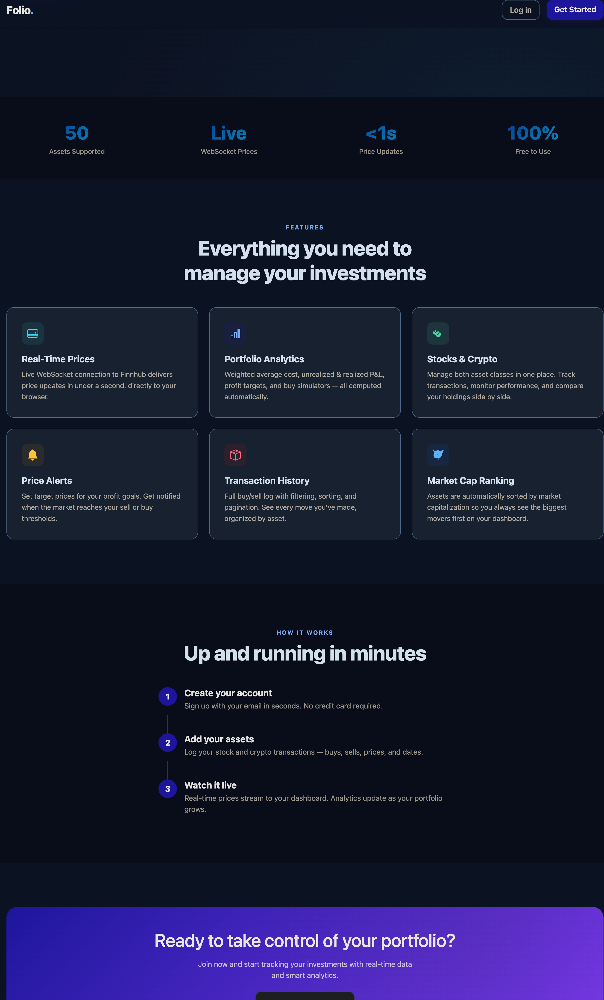

# Portfolio Tracker

A personal portfolio app for tracking stock and cryptocurrency holdings with real-time prices, analytics, and German tax estimates.

## Features

<table>
<tr>
<td valign="top" width="60%">

- **Authentication** — Email-based registration and login
- **Stock & Crypto tracking** — Buy/sell transactions with full history, filtering, sorting, and pagination
- **Real-time prices** — Finnhub WebSocket for crypto, REST polling every 15s for stocks (free-tier limitation)
- **Live dashboard** — Portfolio value updates in real-time via browser WebSocket
- **Allocation charts** — Donut charts on dashboard, stock list, and crypto list pages
- **Analytics** — Weighted-average cost basis, unrealized/realized P&L, sell/buy targets with custom % simulator
- **Price alerts** — DB-backed alerts on target prices, checked on every price tick via Redis cache (zero DB polling). Buy alerts store the planned spend so the trigger email tells you exactly how much to invest.
- **German tax estimates** — Kapitalertragsteuer for stocks (26.375% + Freibetrag), FIFO holding-period rules for crypto (Freigrenze + 1-year tax-free)
- **EUR/USD toggle** — Enter prices in EUR (auto-converts to USD), view analytics/tax in EUR using ECB rates
- **Market status** — NYSE open/closed indicator with countdown timer
- **Market caps** — Fetched from Finnhub (stocks) and CoinGecko (crypto)

</td>
<td valign="top" width="40%" align="center">



</td>
</tr>
</table>

## Tech Stack

| Layer | Technology |
|---|---|
| Backend | Django 6.0, Celery 5.4, Django Channels |
| Frontend | Django Templates, Bootstrap 5.3 |
| Database | SQLite |
| Cache / Broker | Redis |
| Real-time | Finnhub WebSocket + REST API, CoinGecko, Frankfurter (ECB rates) |

## Prerequisites

- **Python 3.12+**
- **Redis** — `brew install redis` on macOS, `sudo apt install redis-server` on Debian/Ubuntu
- A free **Finnhub API key** — sign up at [finnhub.io](https://finnhub.io/)

## Setup

```bash
# 1. Clone and enter the project
git clone <repo-url> && cd portfolio

# 2. Create a virtual environment
python3 -m venv .venv
source .venv/bin/activate

# 3. Install dependencies
pip install -r requirements/base.txt

# 4. Configure environment
cp config/.env.sample config/.env
# Edit config/.env — at minimum, set SECRET_KEY and FINNHUB_API_KEY.
# See the "Environment Variables" section below for details.

# 5. Run migrations
python manage.py migrate

# 6. Create a superuser
python manage.py createsuperuser
```

> **Note:** `setup.sh` is a personal convenience script used during development and is gitignored — it is **not** available in fresh clones. The steps above replace it.

## Running

Once setup is done, start everything with one command:

```bash
./start.sh
```

This launches Redis, the Celery worker, and the Django dev server (ASGI). Press `Ctrl+C` once to shut everything down cleanly.

Open **http://127.0.0.1:8000/** in your browser.

Logs:
- Celery: `tail -f /tmp/folio_celery.log`
- Server: `tail -f /tmp/folio_server.log`

If you'd rather run the services manually (e.g. for debugging):

```bash
# Terminal 1 — Redis
redis-server

# Terminal 2 — Celery worker
celery -A portfolio_project worker --loglevel=info

# Terminal 3 — Django dev server
python manage.py runserver
```

## Environment Variables

All configuration lives in `config/.env`. The file is gitignored; copy `config/.env.sample` as a starting point. Variables are loaded via `python-dotenv` in `portfolio_project/settings.py`.

### Required

| Variable | Description |
|---|---|
| `SECRET_KEY` | Django secret key. Generate with `python -c "from django.core.management.utils import get_random_secret_key; print(get_random_secret_key())"`. |
| `FINNHUB_API_KEY` | Free API key from [finnhub.io](https://finnhub.io/) — used for stock quotes and crypto WebSocket prices. Without this, live prices won't work. |

### Django

| Variable | Default | Description |
|---|---|---|
| `DEBUG` | `False` | Set to `True` for local development. |
| `ALLOWED_HOSTS` | *(empty)* | Comma-separated list, e.g. `127.0.0.1,localhost`. Required when `DEBUG=False`. |
| `SITE_URL` | `http://127.0.0.1:8000` | Base URL used in outbound emails (alert links). |

### Redis / Celery

All three default to a local Redis instance, so you only need to set them if Redis is running elsewhere.

| Variable | Default | Description |
|---|---|---|
| `REDIS_URL` | `redis://localhost:6379/1` | Used for Django cache + Channels layer (price broadcast + alert cache). |
| `CELERY_BROKER_URL` | `redis://localhost:6379/0` | Celery message broker. |
| `CELERY_RESULT_BACKEND` | `redis://localhost:6379/0` | Celery result backend. |

### External APIs

Defaults are fine for normal use; override only if you have a reason.

| Variable | Default |
|---|---|
| `FINNHUB_WS_URL` | `wss://ws.finnhub.io?token={}` |
| `FINNHUB_REST_URL` | `https://finnhub.io/api/v1` |
| `COINGECKO_MARKETS_URL` | CoinGecko markets endpoint |
| `FRANKFURTER_API_URL` | Frankfurter (ECB exchange rates) endpoint |

### Email (for price-alert notifications)

If unset, Django falls back to the console backend (emails print to stdout — fine for local dev).

| Variable | Default | Description |
|---|---|---|
| `EMAIL_BACKEND` | `django.core.mail.backends.smtp.EmailBackend` | Set to `django.core.mail.backends.console.EmailBackend` for dev. |
| `EMAIL_HOST` | `smtp.gmail.com` | |
| `EMAIL_PORT` | `587` | |
| `EMAIL_USE_TLS` | `True` | |
| `EMAIL_HOST_USER` | *(empty)* | SMTP username. |
| `EMAIL_HOST_PASSWORD` | *(empty)* | SMTP password / app-password. |
| `DEFAULT_FROM_EMAIL` | `EMAIL_HOST_USER` | `From:` address for alerts. |

### Tuning (rarely changed)

| Variable | Default | Description |
|---|---|---|
| `BROADCAST_INTERVAL` | `1` | Seconds between browser price broadcasts. |
| `SYNC_INTERVAL` | `5` | Seconds between symbol-map refreshes (detects new assets). |
| `STOCK_QUOTE_INTERVAL` | `15` | Seconds between Finnhub REST polls for stocks. |
| `MARKET_CAP_REFRESH` | `900` | Seconds between market-cap refreshes (15 min). |
| `BACKOFF_INITIAL` | `1` | Initial WebSocket reconnect delay. |
| `BACKOFF_MAX` | `60` | Max WebSocket reconnect delay. |

## Database Schema

| Model | Description |
|---|---|
| **User** | Custom user with UUID, email-based auth, birthdate |
| **Stock / Crypto** | Master asset table — name, symbol, finnhub_symbol |
| **StockAsset / CryptoAsset** | Buy/sell transactions — user, asset FK, price, amount, date, status |
| **PriceAlert** | Target price alerts — user, asset FK, target_price, direction (above/below), invest_amount (optional planned spend for buy alerts), email_sent |
